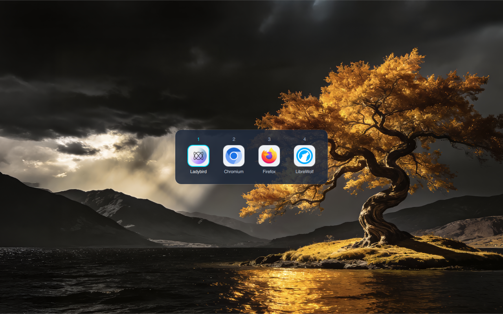

# Luch (Луч)

Link router for Linux/Wayland — the system handler for `http`/`https`
URLs. When any app asks the system to open a link, Luch pops up a fast,
centered picker above everything (wlr-layer-shell overlay) listing your
installed browsers and profiles; pick one, the URL opens there, the
popup is gone.

Named after the Soviet Luch Satellite Data Relay Network: it intercepts
a signal (a link click) and relays it to the right destination.



## Status

v1 is the picker popup. There is no rules engine yet — the config
format reserves `rules[]` so v2 (domain/regex routing, tracker
stripping, remember-per-site) bolts on without migration.

Wayland-only (niri, mangowc, KDE, any compositor with
`zwlr_layer_shell_v1`).

## Build

Dependencies: Qt6 (Core, Gui, Quick/Declarative), `layer-shell-qt`
(Arch: `extra/layer-shell-qt`), `xdgiconqml` (the `XdgIcon` QML module
that resolves browser icons), and a C++20 compiler + CMake ≥ 3.21.

```sh
cmake -B build -DCMAKE_BUILD_TYPE=Release
cmake --build build
sudo cmake --install build
```

`wl-clipboard` is an optional runtime nicety so Ctrl+C survives the
popup exiting. If the `XdgIcon` module is somehow missing at runtime the
picker still works, falling back to letter monograms.

## Wiring it up

```sh
luch --set-default
```

wraps `xdg-mime default luch.desktop x-scheme-handler/http
x-scheme-handler/https`. Or do it by hand:

```sh
xdg-mime default luch.desktop x-scheme-handler/http
xdg-mime default luch.desktop x-scheme-handler/https
```

Luch is never registered at install time — only when you ask.

## Usage

```sh
luch <url|html-file>   # show the picker for a URL or local HTML file
luch --set-default
luch --version
```

Targets are http(s) URLs and local HTML files (`text/html`,
`application/xhtml+xml`) — pass a path or a `file://` URI. Anything
else is refused with exit 2 and a message naming the detected type.

Keyboard: `1`–`9` launch directly, arrow keys + `Enter` or `Space` to
choose, `Esc` dismisses, `Ctrl+C` copies the target. Click works too —
including the copy glyph next to the target line at the bottom, which
always shows what is about to be opened (host and filename are never
truncated; long paths collapse to ` … ` and wrap).

Exit codes: `0` a browser was launched or the target was copied, `1`
dismissed without launching, `2` the target was not routable.

## Config

`~/.config/luch/config.json` (honors `XDG_CONFIG_HOME`), created with
defaults on first run:

```json
{
  "version": 1,
  "ui": { "accent": "cyan", "theme": "light" },
  "browsers": [
    {
      "id": "firefox-work",
      "name": "Firefox (Work)",
      "exec": "firefox -P work %u",
      "icon": "firefox",
      "source": "manual",
      "hidden": false
    }
  ],
  "rules": []
}
```

- The picker lists every installed `.desktop` entry that handles
  `x-scheme-handler/http` (minus `NoDisplay`/`Hidden` ones).
- `browsers[]` entries with `"source": "manual"` are added to the list
  (browser profiles, remote browsers, anything with an Exec line —
  `%u` receives the URL).
- An entry with `"hidden": true` removes a scanned system browser from
  the list.
- `rules[]` is parsed but ignored in v1.

## License

GPL-3.0-or-later — see [LICENSE](LICENSE). REUSE-compliant via
[REUSE.toml](REUSE.toml).
